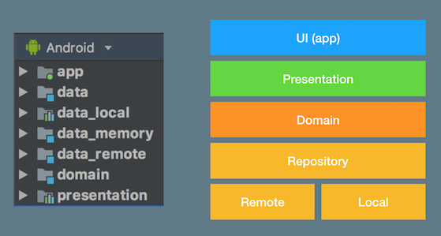
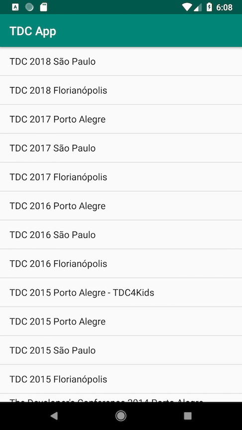
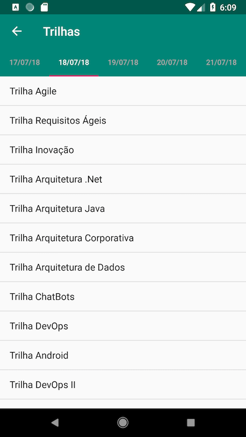
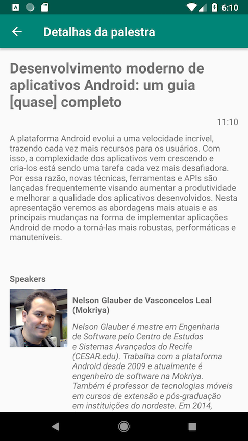

# TDC App
Sample app which access the TDC ([The Developer's Conference](http://www.thedevelopersconference.com.br/tdc/2018/saopaulo/trilhas)) REST API.

In this sample I tried to follow the [Clean Architecture](https://8thlight.com/blog/uncle-bob/2012/08/13/the-clean-architecture.html) principles
and use some cool Android libraries.

The Application is divided in modules as displayed below:



* __UI__ contains all UI related classes (Activities, Fragments, Adapters, etc.). The dependency injection is also declared in this layer.
* __Presentation__ stores all view model classes, once this project is trying to follow the [MVVM pattern](https://en.wikipedia.org/wiki/Model%E2%80%93view%E2%80%93viewmodel).
* __Domain__ in this module are declared the application's use cases and the basic data classes used as [DTO](https://en.wikipedia.org/wiki/Data_transfer_object).
This layer also declares the basic operations that must be provided by the application's repository.
* __Data__ defines a basic repository flow to access two data sources: a remote (to retrieve data from the sever); and local (for now, just to save bookmarked sessions).
* __Data Remote__ contains a implementation of a remote data source.
* __Data Local__ contains a implementation of a local data source.
* __Data Memory__ could be used as remote repository for development purposes (or if you don't have an API key, see the section ).

## Screenshots
### Events List
This screen lists all events organized by Global Code organized by date and showing the most recent on top.



### Modalities List
The activities (e.g.: sessions, workshops, etc.) that will/were occur in the event are displayed in this screen grouped by date.



### Session List
This screen display the sessions for a given modality sorted by time.


### Session details
Session details are shown in this screen, including the speaker and his mini-bio.



## Libraries
This project is written in Kotlin and it's using the following libraries:
* AppCompat
* Android Architecture Components (View Model, Lifecycle, LiveData and Room)
* ConstraintLayout
* Material Design Components Library
* [Glide](https://github.com/bumptech/glide)
* [Gson](https://github.com/google/gson)
* JUnit
* [Koin](https://github.com/InsertKoinIO/koin/)
* [Mockito](http://site.mockito.org/)
* [OkHttp](http://square.github.io/okhttp/)
* [Retrofit](http://square.github.io/retrofit/)
* [Robolectric](https://github.com/robolectric/robolectric)
* [RXJava](https://github.com/ReactiveX/RxJava)

## Get started
This application were created using Android 3.3 Canary 2.
To run this application, you must have a *Client ID* and *Secret* to access the TDC REST API.
To get those information, access the [Global Code](https://www.globalcode.com.br/) web site, create an account and request your credentials.
After that, create the `apikey.properties` file in the root's project directory and put your credentials as below:

```
apiClientId="<YOUR_CLIENT_ID>"
apiSecret="<YOUR_API_SECRET>"
```

But if want to test the app without real data (or you cannot have an API key), just make the following change in the [PersistenceModule.kt](./app/src/main/java/br/com/nglauber/tdcapp/di/PersistenceModule.kt) file.
```kotlin
package br.com.nglauber.tdcapp.di
// ...
val persistenceModule = module {
    ...
    single {
        // Instead of this --> TdcRemoteDataSource(tdcWebService = get()) as RemoteDataSource
        InMemoryRepository() as RemoteDataSource // Use this one
    }
}
```
And that's it! You're good to go.


## IMPORTANT! Credits!
This sample is based on the sample presented by [Joe Birch](https://joebirch.co/) in [his course](https://caster.io/courses/android-clean-architecture) at [caster.io](https://caster.io/).

Any feedback and/or PR's are appreciated! :)